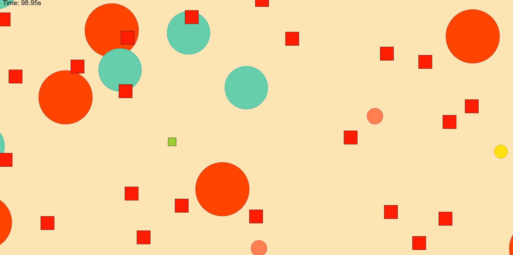

# Dodge the Squares Game

🎮 **Full-Stack Browser Game**  
Frontend: TypeScript, JavaScript, HTML5 Canvas, CSS  
Backend: Node.js, Express, PostgreSQL  

Dodge hazards, survive modifiers, and climb the **global leaderboard**!  

[▶️ Play it in your browser](https://dodge-game-0ir9.onrender.com/)

---



---

**Key Highlights:**
- **Full-Stack Development:** Frontend + backend integration with persistent leaderboards  
- **RESTful API & Database:** Node.js/Express backend storing scores in PostgreSQL  
- **Game Loop & State Management:** Smooth gameplay with dynamic difficulty  
- **Clean, Modular Code:** Object-oriented design and scalable architecture  
- **Deployment-Ready:** Backend and frontend fully deployable

---

## Features

- **Interactive tutorial:** “How to Play” screen introduces controls and objectives  
- **Responsive controls:** Move with arrow keys within game boundaries  
- **Dynamic hazards:** Randomly generated obstacles that damage player health  
- **Modifiers system:**  
  - **Enlarge Hazard:** temporary hazard size increase  
  - **Shrink Hazard:** temporary hazard size decrease  
  - **Ice Rink:** reduced acceleration  
  - **Invincibility:** temporary immunity  
  - **Extra Life:** grants bonus health  
- **Visual feedback:** Flash effects for collisions and modifier expiration  
- **Difficulty scaling:** Logarithmic increase in challenge over time  
- **Pause/resume:** Spacebar toggles pause  
- **Adaptive canvas:** Automatically resizes to fit the browser window  
- **Global Leaderboard** Tracks player scores in real-time and ranks users on a worldwide leaderboard

---

## Technologies

- TypeScript / JavaScript  
- HTML5 Canvas and CSS
- Node.js / Express
- PostgreSQL
- Git + Bash (via MinGW64) for version control  

---

## File Structure

DODGE/
├── client/
│   ├── public/                 # Static files served to the browser
│   └── src/
│       ├── game/               # Core game logic and mechanics
│       ├── game-over/          # Game-over screen logic and graphics
│       ├── graphics/           # Rendering engine, UI elements, and visual assets
│       ├── input/              # Player input handling
│       ├── menu/               # Menu navigation and screen logic
│       └── world/              # Game world entities and environment
│           ├── collision/      # Collision detection and handling
│           └── entities/       # In-game objects and NPCs
├── server/
│   ├── dist/                   # Compiled JavaScript output
│   └── src/                    # Server source code (API endpoints, database logic)
└── README.md                   # Project documentation

---

## Challenges

### Collision-Action Matrix
Managing interactions between multiple simultaneous modifiers was a major design challenge.  
For example, colliding with an **Ice Rink** effect should:  
- Activate if no effect is active  
- Reset if Ice Rink is already active  
- Be ignored if Invincibility is active  

Hard-coding all cases would be unscalable.  

**Solution:** Implemented a strongly-typed collision–action matrix in `config.ts`, structured as:

```ts
collisionMatrix[role: CollisionRole][oldType: ModifierType][newType: ModifierType]
```

This approach ensures clarity, scalability, and type safety when adding new effects

### Collision Detection
Every frame, the game checks whether the **player square** collides with any of the **Hazard squares** or **Modifiers circles**

**Solution:** To handle this efficiently, two classic algorithms are used: 

- **AABB (Axis-Aligned Bounding Box)** → for player–hazard collisions 
- **Circle–AABB** → for player–modifier collisions 

This ensures fast, reliable collision checks even as the number of hazards and modifiers increases.

### Scaling
One of the main challenges I faced while developing this project was not planning for modularity early on. Initially, I wrote large, tightly coupled files without considering how to keep modules short, simple, and isolated. This made the code harder to maintain and extend. As the project grew, I had to refactor significant portions to improve encapsulation and decoupling, which ultimately led to a cleaner, more modular structure.

---

## Future Improvements

- New modifiers: 
  - Blind — temporary screen obstruction 
  - Rain — randomize hazard speed with gradual damping 
  - Wave — sinusoidal hazard movement with gradual damping 
  - Shield — temporary hazard resistance 
- Adjust modifier spawn frequency based on survival time. 
- Leaderboard backend with score submission and display.